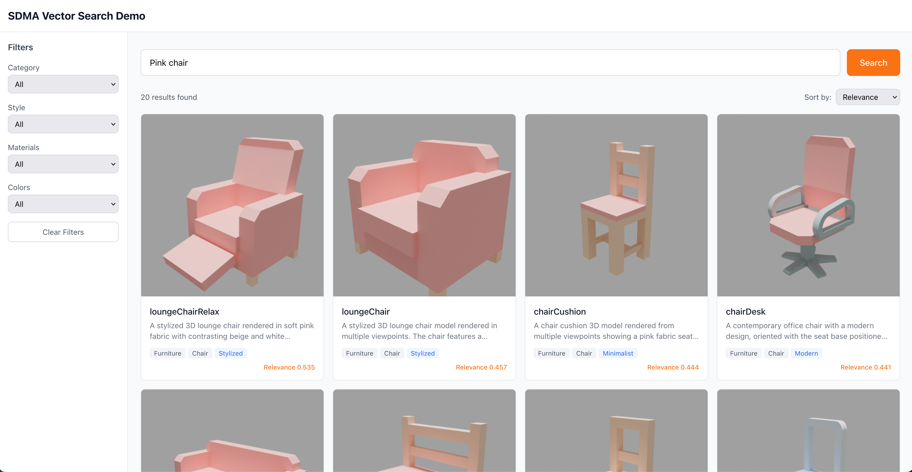
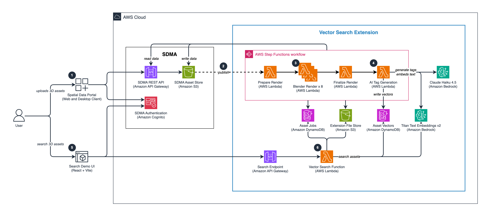

# Spatial Data Management — AI Vector Search Extension

Natural language search for 3D assets in [Spatial Data Management on AWS](https://aws.amazon.com/solutions/implementations/spatial-data-management-on-aws/) (SDMA), powered by AI-generated metadata and vector embeddings.

> **Sample code.** Provided for demonstration and educational purposes. Review,
> test, and harden it for your own security and operational requirements before
> using it in production. See [Security](#security).



## Features

- **Natural Language Search** — Find assets by description ("modern wooden desk with drawers") instead of exact filenames
- **Automatic AI Tagging** — Claude Haiku 4.5 analyzes multi-view renders to extract tags, categories, colors, materials, and descriptions
- **Multi-View Rendering** — Containerized Blender 4.0 generates 8-direction views automatically on upload
- **Zero-Config Trigger** — Integrates with SDMA's connector system; processing starts automatically when assets are uploaded
- **~$15/month for 10K assets** — Uses DynamoDB native vector search instead of OpenSearch Serverless (~$700+/month)

## Architecture



When a 3D asset is uploaded to SDMA, a connector triggers the Extension's processing pipeline:

1. **Render** — Step Functions orchestrates 8 parallel Blender workers (Lambda containers) to generate multi-view PNGs
2. **AI Tag** — Claude Haiku 4.5 analyzes the rendered images and extracts structured metadata
3. **Index** — Titan Embed v2 generates 1024-dim embeddings, stored in DynamoDB with native vector search
4. **Search** — Users query via the Search API or demo UI with natural language and metadata filters

| Component | Technology |
|-----------|------------|
| Processing Pipeline | Step Functions + Lambda |
| Rendering | Lambda Container (Blender 4.0 + Cycles) |
| AI Tagging | Bedrock (Claude Haiku 4.5) |
| Vector Storage | DynamoDB native vector search (1024-dim, Titan Embed v2) |
| Search API | API Gateway + Lambda + Cognito |
| Frontend | React + Tailwind (demo UI) |

[`docs/design.md`](docs/design.md) records the requirements this meets and the
decisions behind them — why DynamoDB's vector index rather than OpenSearch
Serverless, why SDMA is reached only through its API, and what the API cannot do.

## Quick Start

```bash
# 1. Deploy everything (image build + stack + SDMA connector)
./scripts/deploy.sh

# 2. Upload assets (parallel, auto-triggers rendering + AI tagging)
./scripts/test-upload.sh -d /path/to/3d-models/

# 3. Search
./scripts/test-search.sh
```

> **Note:** 3D assets are not included. Download free models from [KayKit](https://kaylousberg.itch.io/kay-kit-furniture), [Sketchfab](https://sketchfab.com/), or [Polyhaven](https://polyhaven.com/). See [`asset-examples/README.md`](asset-examples/README.md).

## Prerequisites

<details>
<summary>SDMA + Tools + Bedrock access</summary>

### SDMA

Verified with:

| Component | Version |
|-----------|---------|
| SDMA Solution | v1.6.0 |
| SDMA CLI | v0.1.7 (`amzn-spatial-data-mgmt`) |
| Spatial Data Portal | v0.2.3 |

Setup:
1. [Deploy SDMA](https://docs.aws.amazon.com/solutions/latest/spatial-data-management-on-aws/deployment-steps.html)
2. [Create initial user](https://docs.aws.amazon.com/solutions/latest/spatial-data-management-on-aws/post-deployment-configuration.html) (Cognito console)
3. **Sign in to the Spatial Data Portal once.** This creates the library every
   SDMA API path is scoped to. `deploy.sh` stops with `SDMA library not found` if
   you skip it.
4. [Install CLI](https://docs.aws.amazon.com/solutions/latest/spatial-data-management-on-aws/client-setup.html) — `pip install amzn-spatial-data-mgmt`
   installs the package; the command it provides is `spatial-data-mgmt`.
5. Authenticate the CLI: `spatial-data-mgmt auth login`. It reuses the browser
   session from step 3, so sign in to the Portal first — the CLI cannot
   authenticate on its own.

Deploy in the **same region as SDMA**. `deploy.sh` discovers SDMA's Cognito pool,
asset bucket, API endpoint, and library within the region your AWS CLI is
configured for.

The identity deploying this needs to create CloudFormation stacks, named IAM
roles, an ECR repository, DynamoDB tables and an S3 bucket, and to attach an
inline policy to SDMA's connector role so the connector may invoke this stack's
functions.

### Tools

| Tool | Version | Installation |
|------|---------|--------------|
| AWS CLI | 2.x | `brew install awscli` |
| AWS SAM CLI | 1.144+ | `brew install aws-sam-cli` |
| Docker or Finch | any | [Docker Desktop](https://www.docker.com/products/docker-desktop) / [Finch](https://github.com/runfinch/finch) |
| Python | 3.11+ | `brew install python` |
| Node.js | 20.19+ or 22.12+ | `brew install node` — required by the demo UI (Vite 8) |
| jq | 1.6+ | `brew install jq` |
| SDMA CLI | 0.1.7+ | [Install guide](https://docs.aws.amazon.com/solutions/latest/spatial-data-management-on-aws/client-setup.html) |

Nothing needs to be installed for boto3: the search Lambda pins `boto3>=1.43.64` in
its own `requirements.txt` (1.43.64 is the first release exposing DynamoDB
`SearchVectors`), and the offline tests pin the same floor in
[`tests/requirements.txt`](tests/requirements.txt).

### Bedrock Model Access

Enable both models **in the region you deploy to**, via
**AWS Console > Amazon Bedrock > Model access**:

| Model | Purpose |
|-------|---------|
| Claude Haiku 4.5 (`global.anthropic.claude-haiku-4-5-20251001-v1:0`) | AI tagging |
| Titan Text Embeddings v2 (`amazon.titan-embed-text-v2:0`) | Vector embeddings |

Nothing checks this before deploying, and the failure is not obvious: uploads
succeed, rendering succeeds, and then tagging fails per asset. `test-upload.sh`
reports `uploaded but never indexed`. If you see that, check these two models
first, then `/aws/lambda/sdma-vector-search/ai-tag-generation-<env>` for the
actual error.

</details>

## Usage

### Deploy / Update

```bash
./scripts/deploy.sh    # Initial deploy or update after config changes (~7 min)
```

### Upload

```bash
./scripts/test-upload.sh model.glb                   # Single file
./scripts/test-upload.sh -d /path/to/models/         # Directory (parallel)
./scripts/test-upload.sh -p "MyProject" model.glb    # Specify project
```

Supported formats: `.glb` (recommended), `.gltf`, `.fbx`, `.obj`, `.blend`

### Search

```bash
./scripts/test-search.sh    # Opens React demo UI in browser
```

API: `POST /assets/search` — see [`api-spec.yaml`](api-spec.yaml) for full OpenAPI 3.0 spec.

## Configuration

Rendering and AI tagging behavior is controlled via YAML configs in [`config/`](config/):

- [`config/rendering/default.yaml`](config/rendering/default.yaml) — Views, resolution, lighting, camera
- [`config/tagging/default.yaml`](config/tagging/default.yaml) — Categories, styles, materials, tag generation

Per-project overrides are supported. See comments in each config file for details.

Apply changes: `./scripts/deploy.sh`

## Tests

Unit tests run offline — AWS clients are faked, so no credentials or deployed
stack are needed:

```bash
pip install -r tests/requirements.txt
pytest
```

See [`tests/README.md`](tests/README.md) for what is covered, and for the rest of
the checks CI runs — the SAM template lint, ShellCheck, `npm audit` and the
frontend build — which are worth running locally before you push.

## Uninstall

Each script is idempotent (safe to re-run):

```bash
./scripts/clean-extension-data.sh    # Remove ECR image, legacy data left in SDMA's bucket, legacy log groups
./scripts/clean-sdma-resources.sh    # Remove SDMA assets/connector/template
./scripts/uninstall.sh               # Delete CloudFormation stack (incl. its DynamoDB tables, data bucket, log groups)
```

The Extension keeps its own data — the rendering and tagging configs and
per-asset intermediates — in a bucket this stack owns, so `uninstall.sh` removes
it with the stack. SDMA's asset bucket is only read (using keys SDMA's API
returns) and written through the short-lived credentials SDMA vends.
`clean-extension-data.sh` clears the `config/` and `assets/` prefixes that
earlier versions wrote into SDMA's bucket.

## Cost Estimate

| Component | Monthly Cost | Notes |
|-----------|-------------|-------|
| DynamoDB (`AssetVectors`) | ~$5 | 10K assets, PAY_PER_REQUEST |
| DynamoDB (`AssetJobs`) | <$1 | Processing state only, 30-day TTL |
| S3 (Extension data) | <$1 | Configs plus per-asset intermediates, expired after 7 days |
| Bedrock (embedding) | ~$5 | Titan Embed v2 |
| Bedrock (AI tagging) | ~$3 | Claude Haiku 4.5 |
| Lambda (rendering) | ~$2 | 8 workers × 30s |
| Lambda (the other four functions) | <$1 | Short invocations, one or a few per asset |
| Step Functions | <$1 | Standard workflow, ~12 state transitions per asset |
| API Gateway | <$1 | Per request; only the demo UI and scripts call it |
| CloudWatch Logs + X-Ray | <$1 | Six log groups with bounded retention; tracing on the API |
| **Total** | **~$15/month** | For 10K assets |

Every row is a resource this stack creates. The ECR repository holding the
Blender image is created by `deploy.sh` rather than the stack, and costs pennies
for a single ~700 MB compressed image; rendered images are written into SDMA's
own asset bucket, so neither is an additional cost of this Extension.

## Project Structure

```
├── backend/lambda/
│   ├── shared/                 # Modules shared between functions
│   ├── Makefile                # SAM build targets for the zip functions
│   └── functions/
│       ├── ai-tag-generation/  # Claude Haiku 4.5 image analysis
│       ├── prepare-render/     # Step Functions entry point
│       ├── blender-render/     # Blender 4.0 container
│       ├── finalize-render/    # SDMA manifest update + file registration
│       └── vector-search-api/  # Search endpoint
├── frontend/search-demo/       # React + Tailwind demo UI
├── infra/                      # SAM template, IAM, Step Functions
├── config/                     # Rendering & tagging YAML configs
├── tests/                      # Offline unit tests for the Lambda backend
└── scripts/                    # Deploy, upload, search, uninstall
```

## Security

[`docs/threat-model.md`](docs/threat-model.md) records the trust boundaries, what
each one mitigates, and — importantly for a sample — the risks it deliberately
accepts. Read the *Known gaps* section before deploying this anywhere that
matters: search is not scoped per project, CORS accepts any origin, and there is
no per-caller rate limiting.

To report a security issue, see
[CONTRIBUTING](CONTRIBUTING.md#security-issue-notifications).

## License

This project is licensed under MIT-0. See [LICENSE](LICENSE) for details.
